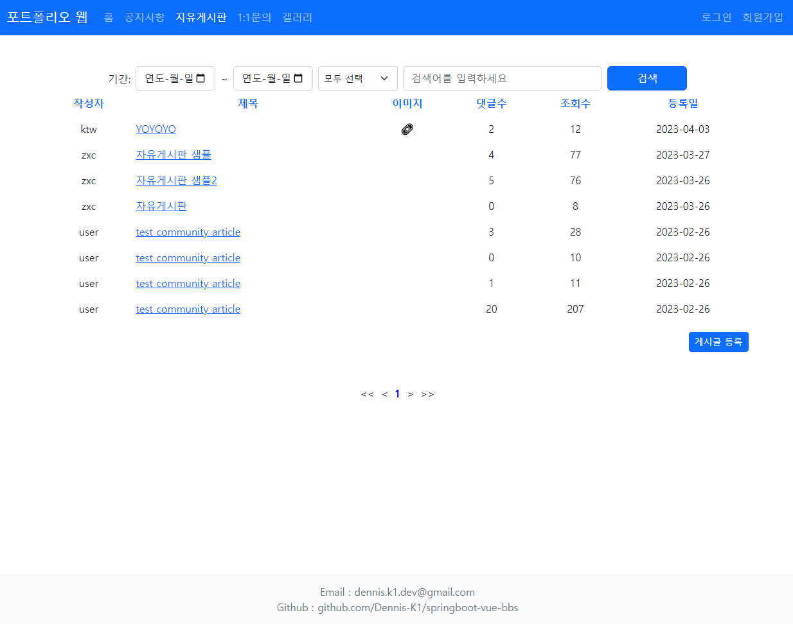
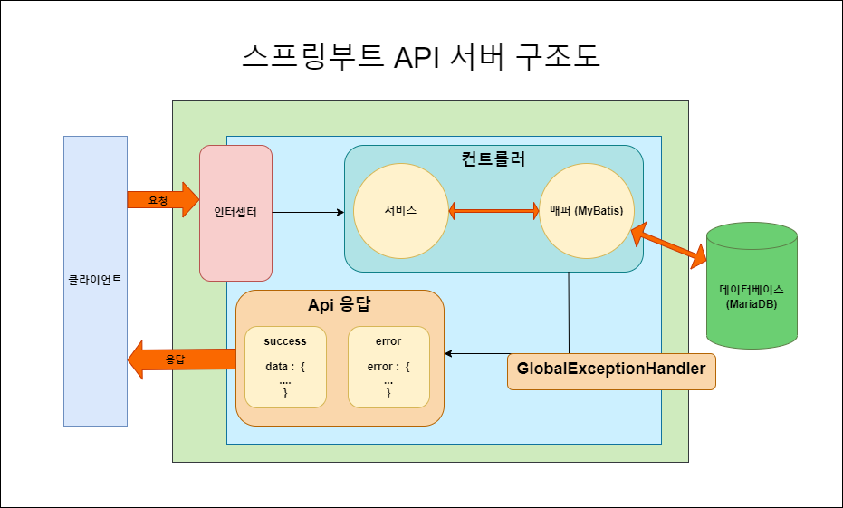
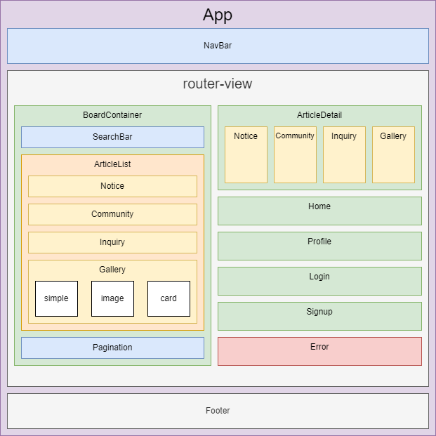
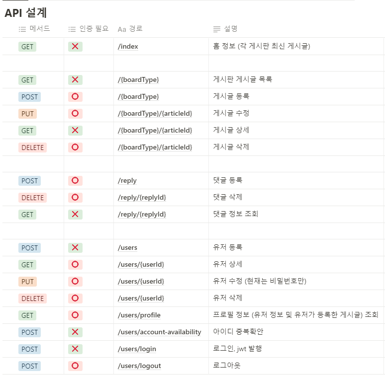
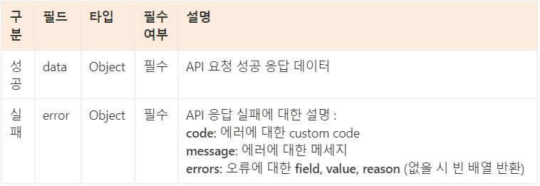
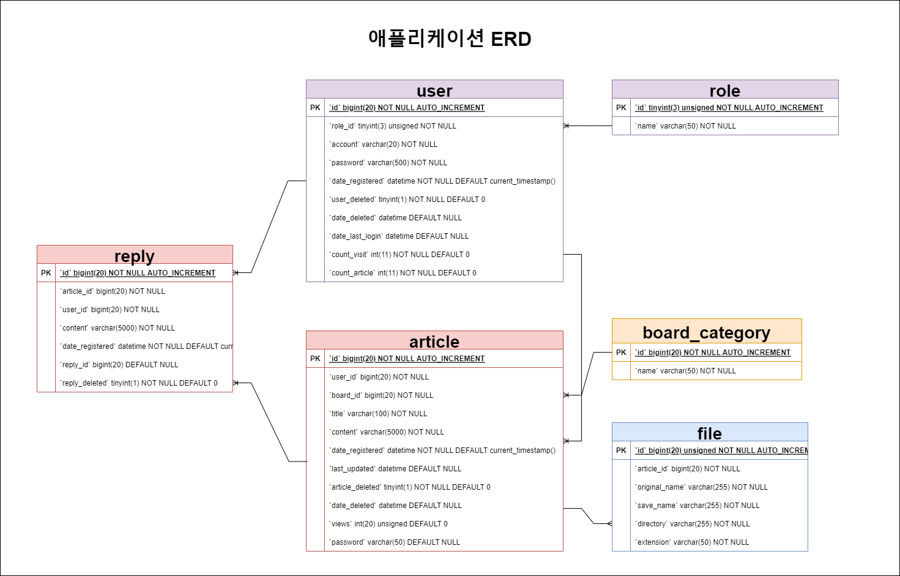

# SPRING BOOT - VUE 종합 게시판

>  Spring Boot와 Vue를 활용한 SPA 멀티 게시판

기존에 Servlet과 JSP를 활용하여 개발했던 MPA 게시판 관리자 웹을 재구성한 SPA 클라이언트 웹으로 기본적인 게시판 기능과 회원 기능을 구현하였습니다..</br>
(Servlet-JSP 관리자 웹 : https://github.com/Dennis-K1/servlet-jsp-bbs)
<br>

개발 기간: 
3 주 </br>
개발 인원: 1 명 </br><br>
기술 스택:
- 백엔드 &nbsp; &nbsp; &nbsp; &nbsp;: Java, SpringBoot, MyBatis, MariaDB
- 프론트엔드 : Javascript, Vue3 (Composition Api), Axios 
- 배포 &nbsp; &nbsp; &nbsp; &nbsp; &nbsp; &nbsp;: GCP, Ubuntu


<br>테스트 링크: 
- http://34.64.151.93/

<br>



<hr>

## 목차

* [핵심 기능](#핵심-기능)
  * [1. 회원 기능](#1-회원-기능)
  * [2. 게시판 기능](#2-게시판-기능)
  * [3. 기타](#3-기타)
* [서비스 구조](#서비스-구조)
  * [백엔드 (SpringBoot)](#백엔드-(SpringBoot))
  * [프론트엔드 (Vue)](#프론트엔드-(Vue))
* [API 설계](#API-설계)
  * [API 경로 및 설명](#API-경로-및-설명)
  * [API 응답 포맷](#API-응답-포맷)
  * [API 문서](#API-문서)
* [코드 샘플](#코드-샘플)
  * [Javadoc](#Javadoc)
  * [백엔드](#백엔드)
  * [프론트엔드](#프론트엔드)
* [ERD](#ERD)


<hr>

## 핵심 기능
> 프로젝트 핵심 구현 기능 및 방법

### 1. 회원 기능
  - [x] 로그인 
    - B/E: 유저 검증 후 jwt 발행
    - F/E: 입력값 유효성 검증, Vuex를 활용하여 jwt 및 사용자 정보 암호화하여 저장
  - [x] jwt
    - B/E: io.jsonwebtoken 라이브러리 활용
  - [x] 로그인 유지
    - B/E: 스프링 인터셉터를 활용하여 jwt 유효성 검증
    - F/E: axios를 통해 api 요청 마다 헤더에 jwt를 담아 전송 
  - [x] 회원가입
    - B/E: 어노테이션을 활용한 유효성 검증 및 유저 등록
    - F/E: 컴포저블을 활용한 유효성 검증 및 회원 가입 로직
  - [x] 프로필 (회원 기본 정보 및 회원이 작성한 글 목록 보기)
  - [x] 로그인 필요 서비스
    - B/E: 토큰 및 유저 유효성 검증
    - F/E: vue router BeforeEach,meta 와 jwt 를 활용하여 로그인 여부 검증
### 2. 게시판 기능
  - [x] 검색 (공통 검색 컴포넌트)
    - Etc: 검색 키워드, 카테고리, 시작일, 종료일, 페이지 번호
  - [x] 페이징 (공통 페이징 컴포넌트)
  - [x] 유효성 검증
    - B/E: 스프링 유효성 검증 어노테이션 활용
    - F/E: 컴포저블 활용
  - [x] 공지사항 (관리자 작성 게시글 조회 전용 게시판)
  - [x] 자유게시판 (게시글 작성, 이미지 업로드, 댓글 및 대댓글 작성 기능)
  - [x] 1:1 문의 (문의 작성 및 답변 여부 확인 기능이 있는 게시판)
  - [x] 갤러리 (3가지 뷰 모드가 있는 이미지 게시판)
### 3. 기타
  - [x] redirectURL (인덱스가 아닌 다른 경로로 접속 시도시, 로그인 후 접속 시도한 페이지로 이동)
  - [x] 클라이언트/서버 유효성 검증
  - [x] Custom API Response
  - [x] Custom Exception
  - [x] GlobalExceptionHandler
    - B/E: @Validated 유효성 검증 실패시 필드와 오류 내용 반환

<hr>

## 서비스 구조
> 프로젝트 애플리케이션 서비스 구조도

### 백엔드 (SpringBoot)


> 클라이언트 요청을 필요한 경우 인터셉터에서 검증 후 컨트롤러로 전달하여, 컨트롤러는 서비스 (비즈니스 로직)
와 매퍼 (DB) 를 통해 데이터를 취합하여 응답.
> 에러가 있는 경우  GlobalExceptionHandler 에서 각 에러에 맞게 설정된 응답 반환.

<br>

<details>
<summary>백엔드 폴더 구조 보기 (접기/펼치기)</summary>

```text
└─com
    └─bbs
        │  SpringbootVueBbsApplication.java
        │  
        ├─common
        │      ApiResponse.java
        │      ErrorResponse.java
        │      
        ├─config
        │      InterceptorConfig.java
        │      MyBatisConfig.java
        │      RedisConfig.java
        │      
        ├─controller
        │      BoardController.java
        │      UserController.java
        │      
        ├─domain
        │      Article.java
        │      File.java
        │      NestedReply.java
        │      PageParameters.java
        │      Reply.java
        │      User.java
        │      
        ├─exception
        │      AccessDeniedException.java
        │      AccountNotAvailableException.java
        │      ArticleNotFoundException.java
        │      ArticleNotMatchingBoardException.java
        │      CustomException.java
        │      DatabaseException.java
        │      DataNotFoundException.java
        │      ErrorCode.java
        │      GlobalExceptionHandler.java
        │      InvalidJwtException.java
        │      UserNotFoundException.java
        │      
        ├─interceptor
        │      JwtInterceptor.java
        │      
        ├─mapper
        │      BoardMapper.java
        │      FileMapper.java
        │      UserMapper.java
        │      
        ├─service
        │      BoardService.java
        │      FileService.java
        │      JwtService.java
        │      UserService.java
        │      
        └─validation
                BoardName.java
                BoardNameValidator.java
                NoAuthentication.java
```

</details>

<br>

### 프론트엔드 (Vue)


> 탑 네비게이션 바와 푸터를 제외한 모든 컴포넌트는 router-view 에서 경로에 맞게 표시하며, 
> 각 컴포넌트의 비즈니스 로직은 각 도메인 컴포저블로 관리.

<br>

<details>
<summary>프론트엔드 폴더 구조 보기 (접기/펼치기)</summary>

```text
│  index.html
│  vite.config.js
└─src
    │  App.vue
    │  main.js
    │          
    ├─components
    │  │  HomePage.vue
    │  │  
    │  ├─boards
    │  │  │  ArticleDetail.vue
    │  │  │  ArticleEditForm.vue
    │  │  │  ArticleInputForm.vue
    │  │  │  ArticleList.vue
    │  │  │  BoardContainer.vue
    │  │  │  
    │  │  ├─community
    │  │  │      CommunityList.vue
    │  │  │      CommunityReplyList.vue
    │  │  │      
    │  │  ├─gallery
    │  │  │  │  GalleryList.vue
    │  │  │  │  
    │  │  │  └─listView
    │  │  │          CardList.vue
    │  │  │          ImageList.vue
    │  │  │          SimpleList.vue
    │  │  │          
    │  │  ├─inquiry
    │  │  │      InquiryDetail.vue
    │  │  │      InquiryList.vue
    │  │  │      
    │  │  ├─notice
    │  │  │      NoticeDetail.vue
    │  │  │      NoticeList.vue
    │  │  │      
    │  │  └─utils
    │  │          PaginationComponent.vue
    │  │          SearchBar.vue
    │  │          
    │  ├─commons
    │  │      FooterComponent.vue
    │  │      NavBar.vue
    │  │      NotFound.vue
    │  │      
    │  └─users
    │          LoginPage.vue
    │          ProfilePage.vue
    │          SignupPage.vue
    │          
    ├─compositions
    │      useBoard.js
    │      useFile.js
    │      useUser.js
    │      useValidation.js
    │      
    ├─modules
    │      apiUtil.js
    │      store.js
    │      
    └─router
            router.js
            routes.js
```
</details>

<br>

<hr>

## API 설계

>   프로젝트 REST API 설계 및 예시

### API 경로 및 설명


```markdown
- 인증 필요 : 로그인이 필요한 경로 표시
  
- {boardType} : 게시판 경로명
    - notice : 공지사항
    - community : 자유게시판
    - inquiry : 1:1 문의
    - gallery : 갤러리
    
- {articleId} : 게시글 번호
  
- {replyId} : 댓글 번호
  
- {userId} : 유저 번호

```
<br>


### API 응답 포맷


```http request
// 예: API 응답 성공

HTTP/1.1 200 OK

    "data": {
        "id": 40,
        "roleId": 1,
        "account": "zxc",
        "dateRegistered": "2023-02-20T01:31:29.000+00:00",
        "countVisit": 627,
        "countArticle": 52,
        "dateLastLogin": "2023-04-02T16:41:28.000+00:00"
    }
```
```http request
// 예: 입력값 유효성 검증 실패

HTTP/1.1 400 Bad Request

    "code": "C001",
    "message": "잘못된 입력값",
    "errors": [
        {
            "field": "title",
            "value": "",
            "reason": "must not be blank"
        }
    ]
```
<br>


### API 문서
https://documenter.getpostman.com/view/25393000/2s93RQUubD


<hr>

## 코드 샘플
>   프로젝트 주요 코드 샘플

### Javadoc
https://dennis-k1.github.io/springboot-vue-bbs/javadoc/

<br>

### 백엔드

#### GlobalExceptionHandler 예시
<a href="https://github.com/Dennis-K1/springboot-vue-bbs/blob/main/src/main/java/com/bbs/exception/GlobalExceptionHandler.java">코드 링크</a>

<details>
<summary> 코드 보기/접기 </summary>

```java
/**
 * 컨트롤러 에러 처리를 위한 핸들러
 */
@Slf4j
@RestControllerAdvice
public class GlobalExceptionHandler {

	/**
	 * 제약 조건 위배 시 발생 (유효성 검사 실패)
	 *
	 * @param exception ConstraintViolationException
	 * @return ResponseEntity status/body
	 */
	@ExceptionHandler(ConstraintViolationException.class)
	protected ResponseEntity handleConstraintViolationException(ConstraintViolationException exception) {
		ErrorResponse errorResponse = ErrorResponse.of(ErrorCode.INVALID_PATH_VALUE, exception.getConstraintViolations());
		return ResponseEntity
			.status(ErrorCode.INVALID_INPUT_VALUE.getStatus())
			.body(errorResponse);
	}
	
	
    ...SKIP...

    
	/**
	 * 자체 정의 에러 발생 시 처리
	 *
	 * @param exception CustomException 을 상속하는 모든 자체 정의 에러
	 * @return ResponseEntity status/body
	 */
	@ExceptionHandler({CustomException.class})
	protected ResponseEntity handleCustomApiException(CustomException exception) {
		ErrorCode errorCode = exception.getErrorCode();
		ErrorResponse errorResponse = ErrorResponse.of(errorCode);
		return ResponseEntity
			.status(errorCode.getStatus())
			.body(errorResponse);
	}

	/**
	 * 상기 정의된 에러 외에 모든 에러에 대한 처리
	 *
	 * @param exception Exception
	 * @return ResponseEntity status/body
	 */
	@ExceptionHandler({Exception.class})
	protected ResponseEntity handleException(Exception exception) {
		ErrorResponse errorResponse = ErrorResponse.of(ErrorCode.INTERNAL_SERVER_ERROR);
		return ResponseEntity
			.status(ErrorCode.INTERNAL_SERVER_ERROR.getStatus())
			.body(errorResponse);
	}
}

```
</details>

#### Controller 예시

<a href="https://github.com/Dennis-K1/springboot-vue-bbs/blob/main/src/main/java/com/bbs/controller/BoardController.java">코드 링크</a>

<details>


<summary> 코드 보기/접기</summary>

```java
// BoardController 'getArticle' 예시 :

/**
 * 게시글 상세 조회
 *
 * @param boardName 게시판명
 * @param articleId 게시글 번호
 * @return 게시글 정보
 * @throws IOException
 */
@NoAuthentication
@GetMapping("{boards}/{articleId}")
public ApiResponse getArticle(
@PathVariable("boards") @BoardName String boardName,
@PathVariable("articleId") @Positive Long articleId) throws IOException {

	Long boardId = boardNameMap.get(boardName);

	boardService.increaseArticleViewsById(articleId);
	Article article = boardService.getArticleById(articleId);
	if (!Objects.equals(article.getBoardId(), boardId)) {
	throw new ArticleNotMatchingBoardException();
	}

	setImageIfExists(article);
	return ApiResponse.success(article);
	}
	
```
</details>


<br>

### 프론트엔드
#### useBoard getArticle 예시

<a href="https://github.com/Dennis-K1/springboot-vue-bbs/blob/main/vue/src/compositions/useBoard.js">useBoard 코드 링크</a>
<a href="https://github.com/Dennis-K1/springboot-vue-bbs/blob/main/vue/src/components/boards/ArticleDetail.vue">articleDetail 코드 링크</a>

<details>

<summary> 코드 보기/접기</summary>

```javascript
  // userBoard

  /**
   * 게시판 상세 조회
   *
   * @param boardPath 게시판 경로
   * @param articleId 게시글 번호
   */
  const getArticle = async (boardPath, articleId) => {
    try {
      const response = await apiClient.get(`${boardPath}/${articleId}`);
      article.value = response.data.data;
      user.value = response.data.data.user;
    } catch (error) {
      alert(error.response.data.message)
      await router.go(-1);
    }
  }
  
  
  // articleDetail getAticle 사용

<template>
  <main class="container">
    <div v-if="boardPath !== 'inquiry'">
      <NoticeDetail/>
      <div v-if="boardPath === 'community'">
        <CommunityReplyList/>
      </div>
    </div>
    <div v-else-if="boardPath === 'inquiry'">
      <InquiryDetail/>
    </div>
  </main>
</template>

<script>
  
  ...SKIP...
  
  export default {
  name: "ArticleDetail",
  components: {NoticeDetail, CommunityReplyList, InquiryDetail }
}
</script>
<script setup>
  import {useRoute} from "vue-router";
  import {onMounted, provide, ref} from "vue";
  import {useBoard} from "/@/compositions/useBoard.js";
  
  const route = useRoute();
  /**
  * article : 게시글 정보
  * user : 유저 정보
  * replyList : 게시글 댓글 목록
  * getArticle : 게시글 조회
  * getReply : 댓글 조회
  */
  const {article, user, replyList, getArticle, getReply} = useBoard();
  
  ...SKIP...
  
  /**
  * 게시글 주입
  */
  provide('article', article);

  ...SKIP...
  
  /**
  * 마운트에 맞추어 데이터 조회
  */
  onMounted( async () => {
  await getArticle(boardPath.value, articleId.value);
  await getReply(articleId.value);
});

</script>

```
</details>

#### vue-router 예시

<a href="https://github.com/Dennis-K1/springboot-vue-bbs/blob/main/vue/src/router/router.js">router 코드 링크</a>

<a href="https://github.com/Dennis-K1/springboot-vue-bbs/blob/main/vue/src/router/routes.js">routes 코드 링크</a>

<hr>

## ERD


- Article 
  - 게시글 데이터 
  - 모든 게시판의 게시글은 통합 테이블인 Article 로 저장되며, board_id 로 게시판 구분.
- Board_Category 
  - 게시판 번호
- Reply 
  - 댓글 데이터
  - 별도의 컬럼으로 대댓글임을 표시.
- File 
  - 파일 데이터
  - 파일의 원본명, 서버 저장명, 저장 디렉토리, 확장자 등의 내용이 저장.
- User 
  - 사용자 데이터 
  - 일반 사용자와 관리자는 role_id 로 구분.
- Role 
  - 사용자 권한
  - 권한 번호와 권한명.


<hr>

